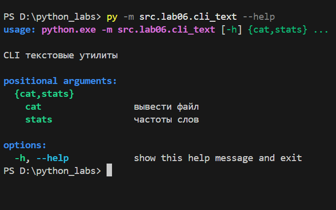
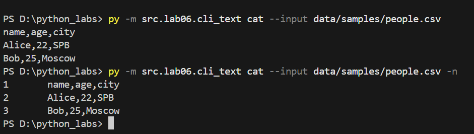
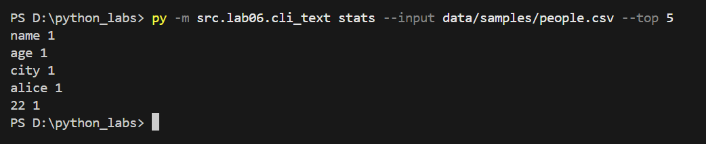
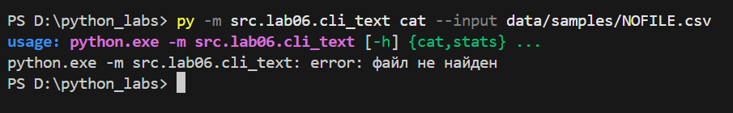
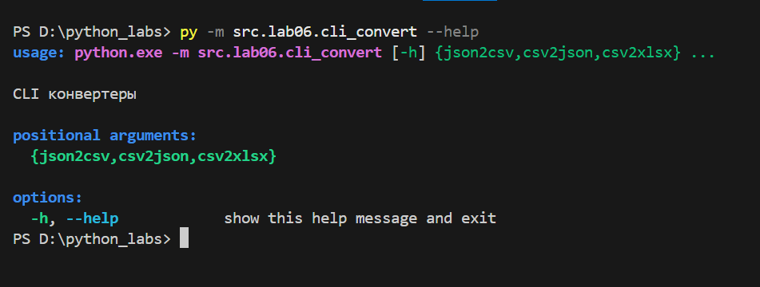
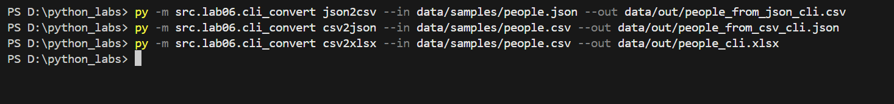
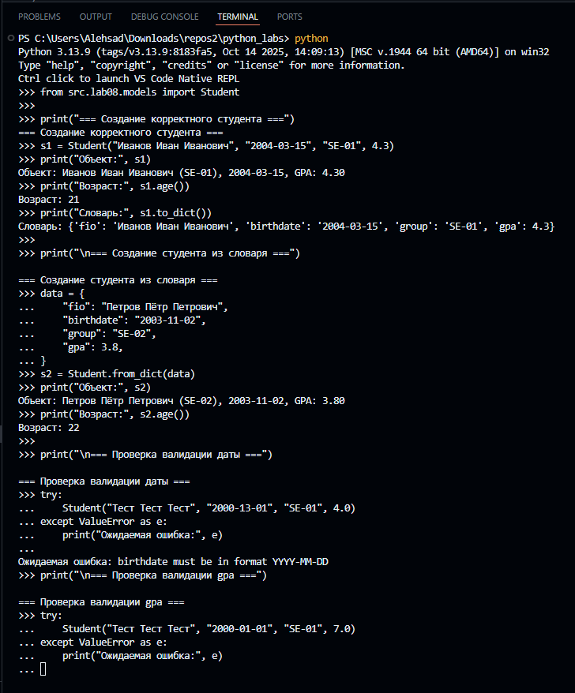
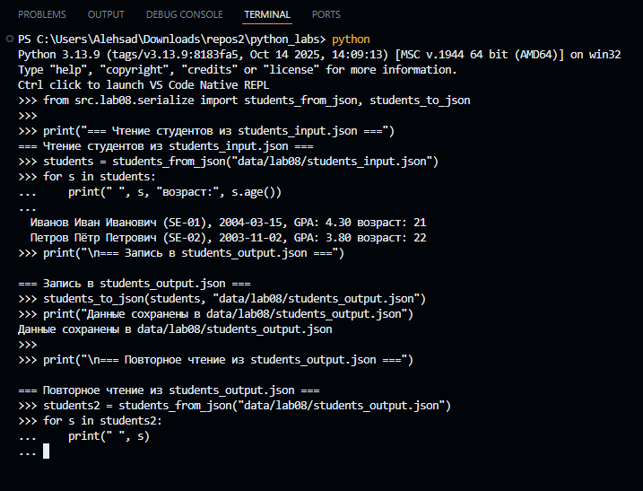
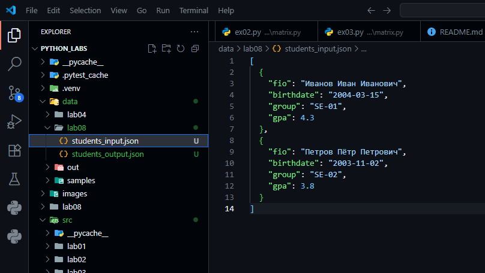
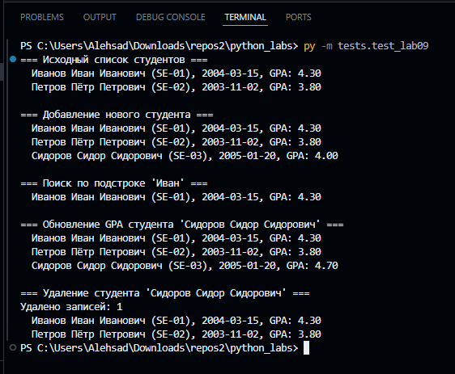

# Alexander

## Лабораторная работа 1

### Задание 1
```python
name = input("Имя: ")
age = int(input("Возраст: "))

print(f"Привет {name}! Через год тебе будет {age + 1}.")
```


### Задание 2
```python
a = input("a: ").replace(",", ".")
b = input("b: ").replace(",", ".")

a, b = float(a), float(b)

s = a + b
avg = s / 2

print("sum=" + str(round(s, 2)) + "; avg=" + str(round(avg, 2)))
```


### Задание 3
```python
price = int(input("Цена (₽): "))
discount = int(input("Скидка (%): "))
vat = int(input("НДС (%): "))

base = price * (1 - discount/100)
vat_amount = base * (vat/100)
total = base + vat_amount

print("База после скидки:", round(base, 2), "₽")
print("НДС:              ", round(vat_amount, 2), "₽")
print("Итого к оплате:   ", round(total, 2), "₽")
```


### Задание 4
```python
m = int(input("Минуты: "))

h = m // 60
mm = m % 60

print(f"{h}:{mm:02d}")
```


### Задание 5
```python
fio = input("ФИО: ")

parts = fio.strip().split()

initials = "".join(p[0].upper() for p in parts) + "."

length = len(fio.strip())

print("Инициалы:", initials)
print("Длина (символов):", length)
```


## Лабораторная работа 2

### Задание 1
```python
def min_max(nums):
    if not nums:
        return "ValueError"
    mn = mx = nums[0]
    for n in nums[1:]:
        if n < mn:
            mn = n
        if n > mx:
            mx = n
    return mn, mx


print(min_max([3, -1, 5, 5, 0]))
print(min_max([42]))
print(min_max([-5, -2, -9]))
print(min_max([]))
print(min_max([1.5, 2, 2.0, -3.1]))


def unique_sorted(nums):
    return sorted(set(nums))

print(unique_sorted([3, 1, 2, 1, 3]))
print(unique_sorted([]))
print(unique_sorted([-1, -1, 0, 2, 2]))
print(unique_sorted([1.0, 1, 2.5, 2.5, 0]))


def flatten(mat: list[list | tuple]) -> list:

  n = []
  for row in mat:
      for i in row:
          if type(i) != int:
            return "TypeError"
          n.append(i)
  return n


print(flatten([[1, 2], [3, 4]]))
print(flatten([[1, 2], (3, 4, 5)]))
print(flatten([[1], [], [2, 3]]))
print(flatten([[1, 2], "ab"]))
```


### Задание 2
```python
def transpose(matrix):
    if not matrix:
        return []

    length = len(matrix[0])
    for row in matrix:
        if len(row) != length:
            return "ValueError"
    return [list(col) for col in zip(*matrix)]


print(transpose([[1, 2, 3]]))
print(transpose([[1], [2], [3]]))
print(transpose([[1, 2], [3, 4]]))
print(transpose([]))


def row_sums(matrix):
    length = len(matrix[0])
    for row in matrix:
        if len(row) != length:
            return "ValueError"

    return [sum(row) for row in matrix]


print(row_sums([[1, 2, 3], [4, 5, 6]]))
print(row_sums([[-1, 1], [10, -10]]))
print(row_sums([[0, 0], [0, 0]]))
print(row_sums([[1, 2], [3]]))


def col_sums(matrix):
    length = len(matrix[0])
    for row in matrix:
        if len(row) != length:
            return "ValueError"

    return [sum(col) for col in zip(*matrix)]


print(col_sums([[1, 2, 3], [4, 5, 6]]))
print(col_sums([[-1, 1], [10, -10]]))
print(col_sums([[0, 0], [0, 0]]))
print(col_sums([[1, 2], [3]]))
```


### Задание 3
```python
def format_record(rec):

    fio, group, gpa = rec

    if not fio.strip() or not group.strip():
        return "ValueError"

    parts = fio.strip().split()
    parts = [p.capitalize() for p in parts]

    if len(parts) < 2:
        return "ValueError"

    surname = parts[0]
    initials = ''
    for p in parts[1:3]:
        initials += p[0].upper() + '.'

    gpa = f"{float(gpa):.2f}"

    return f"{surname} {initials}, гр. {group.strip()}, GPA {gpa}"


print(format_record(("Иванов Иван Иванович", "BIVT-25", 4.6)))
print(format_record(("Петров Пётр", "IKBO-12", 5.0)))
print(format_record(("  сидорова  анна   сергеевна ", "ABB-01", 3.999)))
```


## Лабораторная работа 3

### Задание A
```python
def normalize(text: str, *, casefold: bool = True, yo2e: bool = True) -> str:
    if yo2e:
        text = text.replace("ё", "е").replace("Ё", "Е")

    if casefold:
        text = text.casefold()

    text = text.replace("\n", " ").replace("\r", " ").replace("\t", " ")

    text = " ".join(text.split())

    return text

print(normalize("ПрИвЕт\nМИр\t"))
print(normalize("ёжик, Ёлка"))
print(normalize("Hello\r\nWorld"))
print(normalize("  двойные   пробелы  "))
```


```python
def tokenize(text: str) -> list[str]:
    result = []
    word = ""

    for ch in text:
        if ch.isalnum() or ch == "_" or (ch == "-" and word):
            word += ch
        else:
            if word and word[-1] != "-":
                result.append(word)
            word = ""


    if word and word[-1] != "-":
        result.append(word)

    return result


print(tokenize("привет мир"))
print(tokenize("hello,world!!!"))
print(tokenize("по-настоящему круто"))
print(tokenize("2025 год"))
print(tokenize("emoji 😀 не слово"))
```


```python
def count_freq(tokens: list[str]) -> dict[str, int]:
    freqs = {}
    for token in tokens:
        freqs[token] = freqs.get(token, 0) + 1
    return freqs


def sort_key(item):
    word, count = item
    return (-count, word)


def top_n(freqs: dict[str, int], n: int = 5) -> list[tuple[str, int]]:
    sorted_items = sorted(freqs.items(), key=sort_key)
    return sorted_items[:n]

tokens1 = ["a", "b", "a", "c", "b", "a"]
freqs1 = count_freq(tokens1)
print("Частоты:", freqs1)
print("Top-2:", top_n(freqs1, n=2))
print()

tokens2 = ["bb", "aa", "bb", "aa", "cc"]
freqs2 = count_freq(tokens2)
print("Частоты:", freqs2)
print("Top-2:", top_n(freqs2, n=2))
```


### Задание B
```python
import sys
from src.lib.text import normalize, tokenize, count_freq, top_n

def main():
    text = sys.stdin.read().strip()
    if not text:
        text = input()

    text = normalize(text)
    tokens = tokenize(text)
    freqs = count_freq(tokens)

    print(f"Всего слов: {len(tokens)}")
    print(f"Уникальных слов: {len(freqs)}")
    print("Топ-5:")
    for word, count in top_n(freqs, n=5):
        print(f"{word}:{count}")

main()
```


## Лабораторная работа 4

### Задание A
```python
import csv
from pathlib import Path
from typing import Iterable, Sequence


def read_text(path: str | Path, encoding: str = "utf-8") -> str:
    return Path(path).read_text(encoding=encoding)


def ensure_parent_dir(path: str | Path) -> None:
    pathObj = Path(path)
    parent = pathObj.parent
    if parent and not parent.exists():
        parent.mkdir(parents=True, exist_ok=True)


def write_csv(
    rows: Iterable[Sequence],
    path: str | Path,
    header: tuple[str, ...] | None = None,
) -> None:
    pathObj = Path(path)
    ensure_parent_dir(pathObj)

    rowList = list(rows)
    rowLen: int | None = len(rowList[0]) if rowList else None

    if header is not None:
        if rowLen is None:
            rowLen = len(header)
        elif len(header) != rowLen:
            raise ValueError(
                f"Header length {len(header)} != row length {rowLen}"
            )

    if rowLen is not None:
        for index, row in enumerate(rowList):
            if len(row) != rowLen:
                raise ValueError(
                    f"Row {index} length {len(row)} != expected {rowLen}"
                )

    with pathObj.open("w", encoding="utf-8", newline="") as file:
        writer = csv.writer(file)
        if header is not None:
            writer.writerow(header)
        for row in rowList:
            writer.writerow(row)
```


### Задание B
```python
import sys
import argparse
from pathlib import Path
from typing import Sequence

scriptFile = Path(__file__).resolve()
srcDir = scriptFile.parents[1]
if str(srcDir) not in sys.path:
    sys.path.insert(0, str(srcDir))

from lab04.io_txt_csv import read_text, write_csv
from lib.text import normalize, tokenize, count_freq, top_n


def sorted_word_counts(freq: dict[str, int]) -> list[tuple[str, int]]:
    return sorted(freq.items(), key=lambda pair: (-pair[1], pair[0]))


def report_single(in_path: Path, out_path: Path, encoding: str, top_size: int) -> None:
    text = read_text(in_path, encoding=encoding)
    tokens = tokenize(normalize(text))
    freq = count_freq(tokens)

    print(f"Всего слов: {len(tokens)}")
    print(f"Уникальных слов: {len(freq)}")
    print("Топ-5:")
    for word, amount in top_n(freq, n=top_size):
        print(f"{word}:{amount}")

    rows: list[Sequence] = sorted_word_counts(freq)
    write_csv(rows, out_path, header=("word", "count"))


def report_multi(path_list: list[Path], out_path: Path, encoding: str, top_size: int) -> None:
    all_rows: list[tuple[str, str, int]] = []

    for path in path_list:
        text = read_text(path, encoding=encoding)
        tokens = tokenize(normalize(text))
        freq = count_freq(tokens)

        print(f"[{path}]")
        print(f"Всего слов: {len(tokens)}")
        print(f"Уникальных слов: {len(freq)}")
        print("Топ-5:")
        for word, amount in top_n(freq, n=top_size):
            print(f"{word}:{amount}")

        for word, amount in sorted_word_counts(freq):
            all_rows.append((str(path), word, amount))

    all_rows.sort(key=lambda item: (item[0], -item[2], item[1]))
    write_csv(all_rows, out_path, header=("file", "word", "count"))


def build_parser() -> argparse.ArgumentParser:
    parser = argparse.ArgumentParser()
    parser.add_argument("inputs", nargs="+")
    parser.add_argument("--out", default="data/lab04/report.csv")
    parser.add_argument("--encoding", default="utf-8")
    parser.add_argument("--top", type=int, default=5)
    return parser


def main() -> int:
    args = build_parser().parse_args()
    path_list = [Path(text_path) for text_path in args.inputs]
    out_path = Path(args.out)

    if len(path_list) == 1:
        report_single(path_list[0], out_path, args.encoding, args.top)
    else:
        report_multi(path_list, out_path, args.encoding, args.top)

    print(f"\nГотово: CSV сохранён в {out_path}")
    return 0


main()
```


## Лабораторная работа 5

### Задание A
```python
import json
import csv
from pathlib import Path


def json_to_csv(json_path: str, csv_path: str) -> None:
    json_file = Path(json_path)
    csv_file = Path(csv_path)

    if json_file.suffix.lower() != ".json" or csv_file.suffix.lower() != ".csv":
        raise ValueError("Ожидаются файлы .json (вход) и .csv (выход)")

    try:
        with json_file.open(encoding="utf-8") as f:
            data = json.load(f)
    except FileNotFoundError:
        raise
    except json.JSONDecodeError as e:
        raise ValueError("Пустой JSON или ошибка формата") from e

    if not isinstance(data, list) or not data:
        raise ValueError("Пустой JSON или неподдерживаемая структура (нужен список словарей)")

    if not all(isinstance(item, dict) for item in data):
        raise ValueError("JSON должен содержать только словари")

    fieldnames = list(data[0].keys())
    for row in data[1:]:
        for key in row.keys():
            if key not in fieldnames:
                fieldnames.append(key)

    csv_file.parent.mkdir(parents=True, exist_ok=True)

    with csv_file.open("w", newline="", encoding="utf-8") as f:
        writer = csv.DictWriter(f, fieldnames=fieldnames)
        writer.writeheader()
        for obj in data:
            row = {}
            for key in fieldnames:
                value = obj.get(key, "")
                if value is None:
                    value = ""
                row[key] = str(value)
            writer.writerow(row)


def csv_to_json(csv_path: str, json_path: str) -> None:
    csv_file = Path(csv_path)
    json_file = Path(json_path)

    if csv_file.suffix.lower() != ".csv" or json_file.suffix.lower() != ".json":
        raise ValueError("Ожидаются файлы .csv (вход) и .json (выход)")

    try:
        with csv_file.open(encoding="utf-8") as f:
            reader = csv.DictReader(f)

            if not reader.fieldnames or all(not (h or "").strip() for h in reader.fieldnames):
                raise ValueError("CSV без заголовка или пустой")

            rows = []
            for row in reader:
                clean_row = {}
                for k, v in row.items():
                    clean_row[k] = "" if v is None else str(v)
                rows.append(clean_row)
    except FileNotFoundError:
        raise

    if not rows:
        raise ValueError("Пустой CSV")

    json_file.parent.mkdir(parents=True, exist_ok=True)

    with json_file.open("w", encoding="utf-8") as f:
        import json
        json.dump(rows, f, ensure_ascii=False, indent=2)
```


### Задание B
```python
import csv
from pathlib import Path

from openpyxl import Workbook
from openpyxl.utils import get_column_letter


def csv_to_xlsx(csv_path: str, xlsx_path: str) -> None:
    csv_file = Path(csv_path)
    xlsx_file = Path(xlsx_path)

    if csv_file.suffix.lower() != ".csv" or xlsx_file.suffix.lower() != ".xlsx":
        raise ValueError("Ожидаются файлы .csv (вход) и .xlsx (выход)")

    try:
        with csv_file.open(encoding="utf-8") as f:
            reader = csv.reader(f)

            try:
                header = next(reader)
            except StopIteration:
                raise ValueError("CSV без заголовка или пустой")

            if not header or all((h or "").strip() == "" for h in header):
                raise ValueError("CSV без заголовка")

            rows = [header] + [row for row in reader]
    except FileNotFoundError:
        raise

    if len(rows) <= 1:
        raise ValueError("Пустой CSV")

    wb = Workbook()
    ws = wb.active
    ws.title = "Sheet1"

    max_widths = [max(len(str(cell)), 8) for cell in rows[0]]

    for row in rows:
        ws.append(row)

        if len(row) > len(max_widths):
            max_widths.extend([8] * (len(row) - len(max_widths)))

        for i, cell in enumerate(row):
            length = len(str(cell))
            if length > max_widths[i]:
                max_widths[i] = length

    for col_index, width in enumerate(max_widths, start=1):
        col_letter = get_column_letter(col_index)
        ws.column_dimensions[col_letter].width = max(width, 8)

    xlsx_file.parent.mkdir(parents=True, exist_ok=True)
    wb.save(xlsx_file)
```


## Лабораторная работа 6

### Задание 1
```python
import argparse
from collections import Counter
from pathlib import Path
import re
import sys


def cat(path, numbered):
    try:
        with open(path, encoding="utf-8") as f:
            for i, line in enumerate(f, 1):
                if numbered:
                    print(f"{i}\t{line.rstrip()}")
                else:
                    sys.stdout.write(line)
    except FileNotFoundError:
        raise


def stats(path, top):
    try:
        text = Path(path).read_text(encoding="utf-8")
    except FileNotFoundError:
        raise
    words = re.findall(r"\w+", text.lower())
    for w, c in Counter(words).most_common(top):
        print(w, c)


def main():
    parser = argparse.ArgumentParser(description="CLI текстовые утилиты")
    sub = parser.add_subparsers(dest="cmd", required=True)

    p_cat = sub.add_parser("cat", help="вывести файл")
    p_cat.add_argument("--input", required=True)
    p_cat.add_argument("-n", action="store_true")

    p_stats = sub.add_parser("stats", help="частоты слов")
    p_stats.add_argument("--input", required=True)
    p_stats.add_argument("--top", type=int, default=5)

    args = parser.parse_args()

    try:
        if args.cmd == "cat":
            cat(args.input, args.n)
        else:
            if args.top <= 0:
                parser.error("--top должно быть > 0")
            stats(args.input, args.top)
    except FileNotFoundError:
        parser.error("файл не найден")
    except BrokenPipeError:
        pass


main()
```





### Задание 2
```python
import argparse
from pathlib import Path
from src.lab05.json_csv import json_to_csv, csv_to_json
from src.lab05.csv_xlsx import csv_to_xlsx


def main():
    parser = argparse.ArgumentParser(description="CLI конвертеры")
    sub = parser.add_subparsers(dest="cmd", required=True)

    for name in ("json2csv", "csv2json", "csv2xlsx"):
        p = sub.add_parser(name)
        p.add_argument("--in", dest="input", required=True)
        p.add_argument("--out", dest="output", required=True)

    args = parser.parse_args()

    if not Path(args.input).is_file():
        parser.error("входной файл не найден")

    if args.cmd == "json2csv":
        json_to_csv(args.input, args.output)
    elif args.cmd == "csv2json":
        csv_to_json(args.input, args.output)
    else:
        csv_to_xlsx(args.input, args.output)


main()
```





## Лабораторная работа 7

## Подготовка окружения

```python
PS C:\Users\Alehsad\Downloads\repos2\python_labs> python -m venv .venv
Python 
PS C:\Users\Alehsad\Downloads\repos2\python_labs> .\.venv\Scripts\Activate.ps1
(.venv) PS C:\Users\Alehsad\Downloads\repos2\python_labs> python -m pip install --upgrade pip
Requirement already satisfied: pip in c:\users\alehsad\downloads\repos2\python_labs\.venv\lib\site-packages (25.3)
(.venv) PS C:\Users\Alehsad\Downloads\repos2\python_labs> python -m pip install pytest black
Requirement already satisfied: pytest in c:\users\alehsad\downloads\repos2\python_labs\.venv\lib\site-packages (9.0.1)
Requirement already satisfied: black in c:\users\alehsad\downloads\repos2\python_labs\.venv\lib\site-packages (25.11.0)
Requirement already satisfied: colorama>=0.4 in c:\users\alehsad\downloads\repos2\python_labs\.venv\lib\site-packages (from pytest) (0.4.6)
Requirement already satisfied: iniconfig>=1.0.1 in c:\users\alehsad\downloads\repos2\python_labs\.venv\lib\site-packages (from pytest) (2.3.0)
Requirement already satisfied: packaging>=22 in c:\users\alehsad\downloads\repos2\python_labs\.venv\lib\site-packages (from pytest) (25.0)
Requirement already satisfied: pluggy<2,>=1.5 in c:\users\alehsad\downloads\repos2\python_labs\.venv\lib\site-packages (from pytest) (1.6.0)
Requirement already satisfied: pygments>=2.7.2 in c:\users\alehsad\downloads\repos2\python_labs\.venv\lib\site-packages (from pytest) (2.19.2)
Requirement already satisfied: click>=8.0.0 in c:\users\alehsad\downloads\repos2\python_labs\.venv\lib\site-packages (from black) (8.3.1)
Requirement already satisfied: mypy-extensions>=0.4.3 in c:\users\alehsad\downloads\repos2\python_labs\.venv\lib\site-packages (from black) (1.1.0)
Requirement already satisfied: pathspec>=0.9.0 in c:\users\alehsad\downloads\repos2\python_labs\.venv\lib\site-packages (from black) (0.12.1)
Requirement already satisfied: platformdirs>=2 in c:\users\alehsad\downloads\repos2\python_labs\.venv\lib\site-packages (from black) (4.5.0)
Requirement already satisfied: pytokens>=0.3.0 in c:\users\alehsad\downloads\repos2\python_labs\.venv\lib\site-packages (from black) (0.3.0)
```

## pytest -q

```python
(.venv) PS C:\Users\Alehsad\Downloads\repos2\python_labs> pytest -q
.......                                                                                                                                                                                     [100%]
7 passed in 0.15s
```

## black .

```python
(.venv) PS C:\Users\Alehsad\Downloads\repos2\python_labs>     black .
All done! ✨ 🍰 ✨
27 files left unchanged.
```
## black --check .

```python
(.venv) PS C:\Users\Alehsad\Downloads\repos2\python_labs> black --check .
All done! ✨ 🍰 ✨
27 files would be left unchanged.
```


## Лабораторная работа 8

### Задание A

```python
from dataclasses import dataclass
from datetime import datetime, date


@dataclass
class Student:
    fio: str
    birthdate: str
    group: str
    gpa: float

    def __post_init__(self) -> None:
        try:
            datetime.strptime(self.birthdate, "%Y-%m-%d")
        except ValueError:
            raise ValueError(
                "birthdate must be in format YYYY-MM-DD"
            )

        try:
            self.gpa = float(self.gpa)
        except (TypeError, ValueError):
            raise ValueError(f"gpa must be a number, got {self.gpa!r}")

        if not (0.0 <= self.gpa <= 5.0):
            raise ValueError("gpa must be between 0 and 5")

    def age(self) -> int:
        birth = datetime.strptime(self.birthdate, "%Y-%m-%d").date()
        today = date.today()
        years = today.year - birth.year

        if (today.month, today.day) < (birth.month, birth.day):
            years -= 1

        return years

    def to_dict(self) -> dict:
        return {
            "fio": self.fio,
            "birthdate": self.birthdate,
            "group": self.group,
            "gpa": self.gpa,
        }

    @classmethod
    def from_dict(cls, data: dict) -> "Student":
        return cls(
            fio=data["fio"],
            birthdate=data["birthdate"],
            group=data["group"],
            gpa=data["gpa"],
        )

    def __str__(self) -> str:
        return f"{self.fio} ({self.group}), {self.birthdate}, GPA: {self.gpa:.2f}"
```



### Задание B

```python
import json

from .models import Student


def students_to_json(students, path):
    data = [s.to_dict() for s in students]

    with open(path, "w", encoding="utf-8") as f:
        json.dump(data, f, ensure_ascii=False, indent=2)


def students_from_json(path) -> list[Student]:
    with open(path, "r", encoding="utf-8") as f:
        raw = json.load(f)

    if not isinstance(raw, list):
        raise ValueError("JSON must contain a list of students")

    students: list[Student] = []
    for item in raw:
        if not isinstance(item, dict):
            raise ValueError("Each item in JSON list must be an object")
        students.append(Student.from_dict(item))

    return students
```



### students input/output




## Лабораторная работа 9

### Задание A

```python
import csv
from pathlib import Path
from typing import List

from src.lab08.models import Student

_FIELDNAMES = ["fio", "birthdate", "group", "gpa"]

class Group:
    def __init__(self, storage_path: str) -> None:
        self.path = Path(storage_path)
        self._ensure_storage_exists()


    def _ensure_storage_exists(self) -> None:
        self.path.parent.mkdir(parents=True, exist_ok=True)
        if not self.path.exists():
            with self.path.open("w", encoding="utf-8", newline="") as f:
                writer = csv.writer(f)
                writer.writerow(_FIELDNAMES)

    def _read_all(self) -> list[dict]:
        self._ensure_storage_exists()

        with self.path.open("r", encoding="utf-8", newline="") as f:
            reader = csv.DictReader(f)

            if reader.fieldnames != _FIELDNAMES:
                raise ValueError(
                    "Некорректный заголовок CSV. "
                    f"Ожидается: {','.join(_FIELDNAMES)}, "
                    f"получено: {reader.fieldnames}"
                )

            rows = list(reader)

        for row in rows:
            Student.from_dict(row)

        return rows

    def _write_all(self, rows: list[dict]) -> None:
        """Перезаписать CSV-файл переданными строками."""
        with self.path.open("w", encoding="utf-8", newline="") as f:
            writer = csv.DictWriter(f, fieldnames=_FIELDNAMES)
            writer.writeheader()
            writer.writerows(rows)

    def list(self) -> List[Student]:
        rows = self._read_all()
        return [Student.from_dict(row) for row in rows]

    def add(self, student: Student) -> None:
        rows = self._read_all()
        rows.append(student.to_dict())
        self._write_all(rows)

    def find(self, substr: str) -> List[Student]:
        substr_lower = substr.lower()
        return [
            s for s in self.list()
            if substr_lower in s.fio.lower()
        ]

    def remove(self, fio: str) -> int:
        rows = self._read_all()
        new_rows = [r for r in rows if r["fio"] != fio]
        removed_count = len(rows) - len(new_rows)
        self._write_all(new_rows)
        return removed_count

    def update(self, fio: str, **fields) -> bool:
        rows = self._read_all()
        updated = False

        for row in rows:
            if row["fio"] == fio:
                for key, value in fields.items():
                    if key not in _FIELDNAMES:
                        raise KeyError(f"Неизвестное поле для обновления: {key}")
                    row[key] = value

                Student.from_dict(row)

                updated = True
                break

        if updated:
            self._write_all(rows)

        return updated
```
### Быстрая проверка CRUD

```python
from src.lab08.models import Student
from src.lab09.group import Group


def main() -> None:
    group = Group("data/lab09/students.csv")

    print("=== Исходный список студентов ===")
    for s in group.list():
        print(" ", s)

    print("\n=== Добавление нового студента ===")
    new_student = Student("Сидоров Сидор Сидорович", "2005-01-20", "SE-03", 4.0)
    group.add(new_student)
    for s in group.list():
        print(" ", s)

    print("\n=== Поиск по подстроке 'Иван' ===")
    for s in group.find("Иван"):
        print(" ", s)

    print("\n=== Обновление GPA студента 'Сидоров Сидор Сидорович' ===")
    group.update("Сидоров Сидор Сидорович", gpa=4.7)
    for s in group.list():
        print(" ", s)

    print("\n=== Удаление студента 'Сидоров Сидор Сидорович' ===")
    removed = group.remove("Сидоров Сидор Сидорович")
    print("Удалено записей:", removed)
    for s in group.list():
        print(" ", s)


if __name__ == "__main__":
    main()
```


