# Alexander

## Лабораторная работа 1

### Задание 1
```python
name = input("Имя: ")
age = int(input("Возраст: "))

print(f"Привет {name}! Через год тебе будет {age + 1}.")
```
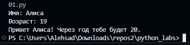

### Задание 2
```python
a = input("a: ").replace(",", ".")
b = input("b: ").replace(",", ".")

a, b = float(a), float(b)

s = a + b
avg = s / 2

print("sum=" + str(round(s, 2)) + "; avg=" + str(round(avg, 2)))
```


### Задание 3
```python
price = int(input("Цена (₽): "))
discount = int(input("Скидка (%): "))
vat = int(input("НДС (%): "))

base = price * (1 - discount/100)
vat_amount = base * (vat/100)
total = base + vat_amount

print("База после скидки:", round(base, 2), "₽")
print("НДС:              ", round(vat_amount, 2), "₽")
print("Итого к оплате:   ", round(total, 2), "₽")
```


### Задание 4
```python
m = int(input("Минуты: "))

h = m // 60
mm = m % 60

print(f"{h}:{mm:02d}")
```


### Задание 5
```python
fio = input("ФИО: ")

parts = fio.strip().split()

initials = "".join(p[0].upper() for p in parts) + "."

length = len(fio.strip())

print("Инициалы:", initials)
print("Длина (символов):", length)
```
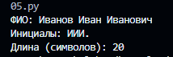


## Лабораторная работа 2

### Задание 1
```python
def min_max(nums):
    if not nums:
        return "ValueError"
    mn = mx = nums[0]
    for n in nums[1:]:
        if n < mn:
            mn = n
        if n > mx:
            mx = n
    return mn, mx


print(min_max([3, -1, 5, 5, 0]))
print(min_max([42]))
print(min_max([-5, -2, -9]))
print(min_max([]))
print(min_max([1.5, 2, 2.0, -3.1]))


def unique_sorted(nums):
    return sorted(set(nums))

print(unique_sorted([3, 1, 2, 1, 3]))
print(unique_sorted([]))
print(unique_sorted([-1, -1, 0, 2, 2]))
print(unique_sorted([1.0, 1, 2.5, 2.5, 0]))


def flatten(mat: list[list | tuple]) -> list:

  n = []
  for row in mat:
      for i in row:
          if type(i) != int:
            return "TypeError"
          n.append(i)
  return n


print(flatten([[1, 2], [3, 4]]))
print(flatten([[1, 2], (3, 4, 5)]))
print(flatten([[1], [], [2, 3]]))
print(flatten([[1, 2], "ab"]))
```
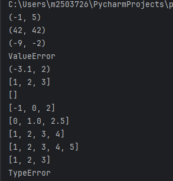

### Задание 2
```python
def transpose(matrix):
    if not matrix:
        return []

    length = len(matrix[0])
    for row in matrix:
        if len(row) != length:
            return "ValueError"
    return [list(col) for col in zip(*matrix)]


print(transpose([[1, 2, 3]]))
print(transpose([[1], [2], [3]]))
print(transpose([[1, 2], [3, 4]]))
print(transpose([]))


def row_sums(matrix):
    length = len(matrix[0])
    for row in matrix:
        if len(row) != length:
            return "ValueError"

    return [sum(row) for row in matrix]


print(row_sums([[1, 2, 3], [4, 5, 6]]))
print(row_sums([[-1, 1], [10, -10]]))
print(row_sums([[0, 0], [0, 0]]))
print(row_sums([[1, 2], [3]]))


def col_sums(matrix):
    length = len(matrix[0])
    for row in matrix:
        if len(row) != length:
            return "ValueError"

    return [sum(col) for col in zip(*matrix)]


print(col_sums([[1, 2, 3], [4, 5, 6]]))
print(col_sums([[-1, 1], [10, -10]]))
print(col_sums([[0, 0], [0, 0]]))
print(col_sums([[1, 2], [3]]))
```


### Задание 3
```python
def format_record(rec):

    fio, group, gpa = rec

    if not fio.strip() or not group.strip():
        return "ValueError"

    parts = fio.strip().split()
    parts = [p.capitalize() for p in parts]

    if len(parts) < 2:
        return "ValueError"

    surname = parts[0]
    initials = ''
    for p in parts[1:3]:
        initials += p[0].upper() + '.'

    gpa = f"{float(gpa):.2f}"

    return f"{surname} {initials}, гр. {group.strip()}, GPA {gpa}"


print(format_record(("Иванов Иван Иванович", "BIVT-25", 4.6)))
print(format_record(("Петров Пётр", "IKBO-12", 5.0)))
print(format_record(("  сидорова  анна   сергеевна ", "ABB-01", 3.999)))
```


## Лабораторная работа 3

### Задание A
```python
def normalize(text: str, *, casefold: bool = True, yo2e: bool = True) -> str:
    if yo2e:
        text = text.replace("ё", "е").replace("Ё", "Е")

    if casefold:
        text = text.casefold()

    text = text.replace("\n", " ").replace("\r", " ").replace("\t", " ")

    text = " ".join(text.split())

    return text

print(normalize("ПрИвЕт\nМИр\t"))
print(normalize("ёжик, Ёлка"))
print(normalize("Hello\r\nWorld"))
print(normalize("  двойные   пробелы  "))
```


```python
def tokenize(text: str) -> list[str]:
    result = []
    word = ""

    for ch in text:
        if ch.isalnum() or ch == "_" or (ch == "-" and word):
            word += ch
        else:
            if word and word[-1] != "-":
                result.append(word)
            word = ""


    if word and word[-1] != "-":
        result.append(word)

    return result


print(tokenize("привет мир"))
print(tokenize("hello,world!!!"))
print(tokenize("по-настоящему круто"))
print(tokenize("2025 год"))
print(tokenize("emoji 😀 не слово"))
```


```python
def count_freq(tokens: list[str]) -> dict[str, int]:
    freqs = {}
    for token in tokens:
        freqs[token] = freqs.get(token, 0) + 1
    return freqs


def sort_key(item):
    word, count = item
    return (-count, word)


def top_n(freqs: dict[str, int], n: int = 5) -> list[tuple[str, int]]:
    sorted_items = sorted(freqs.items(), key=sort_key)
    return sorted_items[:n]

tokens1 = ["a", "b", "a", "c", "b", "a"]
freqs1 = count_freq(tokens1)
print("Частоты:", freqs1)
print("Top-2:", top_n(freqs1, n=2))
print()

tokens2 = ["bb", "aa", "bb", "aa", "cc"]
freqs2 = count_freq(tokens2)
print("Частоты:", freqs2)
print("Top-2:", top_n(freqs2, n=2))
```


### Задание B
```python
import sys
from src.lib.text import normalize, tokenize, count_freq, top_n

def main():
    text = sys.stdin.read().strip()
    if not text:
        text = input()

    text = normalize(text)
    tokens = tokenize(text)
    freqs = count_freq(tokens)

    print(f"Всего слов: {len(tokens)}")
    print(f"Уникальных слов: {len(freqs)}")
    print("Топ-5:")
    for word, count in top_n(freqs, n=5):
        print(f"{word}:{count}")

main()
```


## Лабораторная работа 4

### Задание A
```python
import csv
from pathlib import Path
from typing import Iterable, Sequence


def read_text(path: str | Path, encoding: str = "utf-8") -> str:
    """Прочитать файл целиком и вернуть содержимое как строку."""
    return Path(path).read_text(encoding=encoding)


def ensure_parent_dir(path: str | Path) -> None:
    """Создать родительскую папку для path, если её ещё нет."""
    pathObj = Path(path)
    parent = pathObj.parent
    if parent and not parent.exists():
        parent.mkdir(parents=True, exist_ok=True)


def write_csv(
    rows: Iterable[Sequence],
    path: str | Path,
    header: tuple[str, ...] | None = None,
) -> None:
    """Записать строки в CSV-файл с разделителем запятая."""
    pathObj = Path(path)
    ensure_parent_dir(pathObj)

    rowList = list(rows)
    rowLen: int | None = len(rowList[0]) if rowList else None

    if header is not None:
        if rowLen is None:
            rowLen = len(header)
        elif len(header) != rowLen:
            raise ValueError(
                f"Header length {len(header)} != row length {rowLen}"
            )

    if rowLen is not None:
        for index, row in enumerate(rowList):
            if len(row) != rowLen:
                raise ValueError(
                    f"Row {index} length {len(row)} != expected {rowLen}"
                )

    with pathObj.open("w", encoding="utf-8", newline="") as file:
        writer = csv.writer(file)
        if header is not None:
            writer.writerow(header)
        for row in rowList:
            writer.writerow(row)
```

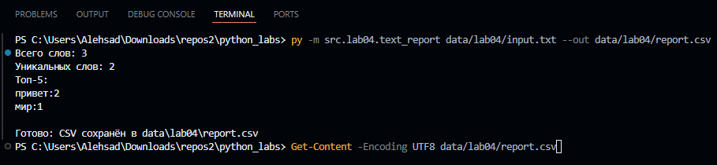

### Задание B
```python
import sys
import argparse
from pathlib import Path
from typing import Sequence

scriptFile = Path(__file__).resolve()
srcDir = scriptFile.parents[1]
if str(srcDir) not in sys.path:
    sys.path.insert(0, str(srcDir))

from lab04.io_txt_csv import read_text, write_csv
from lib.text import normalize, tokenize, count_freq, top_n


def sorted_word_counts(freq: dict[str, int]) -> list[tuple[str, int]]:
    return sorted(freq.items(), key=lambda pair: (-pair[1], pair[0]))


def report_single(in_path: Path, out_path: Path, encoding: str, top_size: int) -> None:
    text = read_text(in_path, encoding=encoding)
    tokens = tokenize(normalize(text))
    freq = count_freq(tokens)

    print(f"Всего слов: {len(tokens)}")
    print(f"Уникальных слов: {len(freq)}")
    print("Топ-5:")
    for word, amount in top_n(freq, n=top_size):
        print(f"{word}:{amount}")

    rows: list[Sequence] = sorted_word_counts(freq)
    write_csv(rows, out_path, header=("word", "count"))


def report_multi(path_list: list[Path], out_path: Path, encoding: str, top_size: int) -> None:
    all_rows: list[tuple[str, str, int]] = []

    for path in path_list:
        text = read_text(path, encoding=encoding)
        tokens = tokenize(normalize(text))
        freq = count_freq(tokens)

        print(f"[{path}]")
        print(f"Всего слов: {len(tokens)}")
        print(f"Уникальных слов: {len(freq)}")
        print("Топ-5:")
        for word, amount in top_n(freq, n=top_size):
            print(f"{word}:{amount}")

        for word, amount in sorted_word_counts(freq):
            all_rows.append((str(path), word, amount))

    all_rows.sort(key=lambda item: (item[0], -item[2], item[1]))
    write_csv(all_rows, out_path, header=("file", "word", "count"))


def build_parser() -> argparse.ArgumentParser:
    parser = argparse.ArgumentParser()
    parser.add_argument("inputs", nargs="+")
    parser.add_argument("--out", default="data/lab04/report.csv")
    parser.add_argument("--encoding", default="utf-8")
    parser.add_argument("--top", type=int, default=5)
    return parser


def main() -> int:
    args = build_parser().parse_args()
    path_list = [Path(text_path) for text_path in args.inputs]
    out_path = Path(args.out)

    if len(path_list) == 1:
        report_single(path_list[0], out_path, args.encoding, args.top)
    else:
        report_multi(path_list, out_path, args.encoding, args.top)

    print(f"\nГотово: CSV сохранён в {out_path}")
    return 0


main()
```

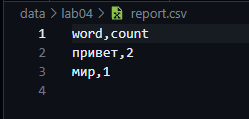
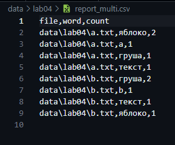


## Лабораторная работа 5

### Задание A
```python
import json
import csv
from pathlib import Path


def json_to_csv(json_path: str, csv_path: str) -> None:
    json_file = Path(json_path)
    csv_file = Path(csv_path)

    if json_file.suffix.lower() != ".json" or csv_file.suffix.lower() != ".csv":
        raise ValueError("Ожидаются файлы .json (вход) и .csv (выход)")

    try:
        with json_file.open(encoding="utf-8") as f:
            data = json.load(f)
    except FileNotFoundError:
        raise
    except json.JSONDecodeError as e:
        raise ValueError("Пустой JSON или ошибка формата") from e

    if not isinstance(data, list) or not data:
        raise ValueError("Пустой JSON или неподдерживаемая структура (нужен список словарей)")

    if not all(isinstance(item, dict) for item in data):
        raise ValueError("JSON должен содержать только словари")

    fieldnames = list(data[0].keys())
    for row in data[1:]:
        for key in row.keys():
            if key not in fieldnames:
                fieldnames.append(key)

    csv_file.parent.mkdir(parents=True, exist_ok=True)

    with csv_file.open("w", newline="", encoding="utf-8") as f:
        writer = csv.DictWriter(f, fieldnames=fieldnames)
        writer.writeheader()
        for obj in data:
            row = {}
            for key in fieldnames:
                value = obj.get(key, "")
                if value is None:
                    value = ""
                row[key] = str(value)
            writer.writerow(row)


def csv_to_json(csv_path: str, json_path: str) -> None:
    csv_file = Path(csv_path)
    json_file = Path(json_path)

    if csv_file.suffix.lower() != ".csv" or json_file.suffix.lower() != ".json":
        raise ValueError("Ожидаются файлы .csv (вход) и .json (выход)")

    try:
        with csv_file.open(encoding="utf-8") as f:
            reader = csv.DictReader(f)

            if not reader.fieldnames or all(not (h or "").strip() for h in reader.fieldnames):
                raise ValueError("CSV без заголовка или пустой")

            rows = []
            for row in reader:
                clean_row = {}
                for k, v in row.items():
                    clean_row[k] = "" if v is None else str(v)
                rows.append(clean_row)
    except FileNotFoundError:
        raise

    if not rows:
        raise ValueError("Пустой CSV")

    json_file.parent.mkdir(parents=True, exist_ok=True)

    with json_file.open("w", encoding="utf-8") as f:
        import json
        json.dump(rows, f, ensure_ascii=False, indent=2)
```

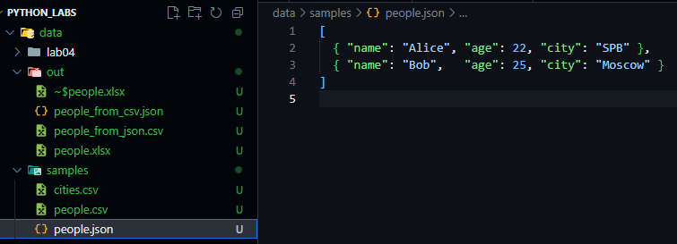
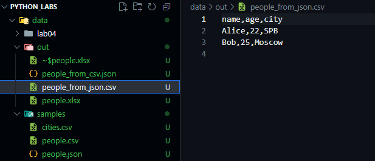
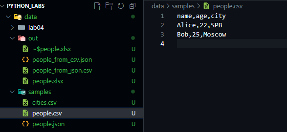
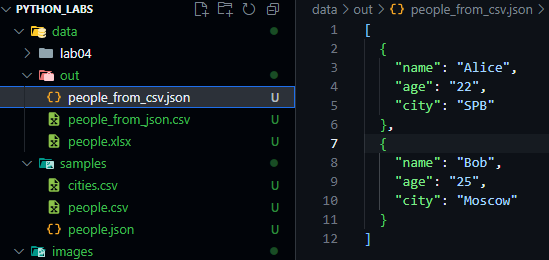

### Задание B
```python
import csv
from pathlib import Path

from openpyxl import Workbook
from openpyxl.utils import get_column_letter


def csv_to_xlsx(csv_path: str, xlsx_path: str) -> None:
    csv_file = Path(csv_path)
    xlsx_file = Path(xlsx_path)

    if csv_file.suffix.lower() != ".csv" or xlsx_file.suffix.lower() != ".xlsx":
        raise ValueError("Ожидаются файлы .csv (вход) и .xlsx (выход)")

    try:
        with csv_file.open(encoding="utf-8") as f:
            reader = csv.reader(f)

            try:
                header = next(reader)
            except StopIteration:
                raise ValueError("CSV без заголовка или пустой")

            if not header or all((h or "").strip() == "" for h in header):
                raise ValueError("CSV без заголовка")

            rows = [header] + [row for row in reader]
    except FileNotFoundError:
        raise

    if len(rows) <= 1:
        raise ValueError("Пустой CSV")

    wb = Workbook()
    ws = wb.active
    ws.title = "Sheet1"

    max_widths = [max(len(str(cell)), 8) for cell in rows[0]]

    for row in rows:
        ws.append(row)

        if len(row) > len(max_widths):
            max_widths.extend([8] * (len(row) - len(max_widths)))

        for i, cell in enumerate(row):
            length = len(str(cell))
            if length > max_widths[i]:
                max_widths[i] = length

    for col_index, width in enumerate(max_widths, start=1):
        col_letter = get_column_letter(col_index)
        ws.column_dimensions[col_letter].width = max(width, 8)

    xlsx_file.parent.mkdir(parents=True, exist_ok=True)
    wb.save(xlsx_file)
```

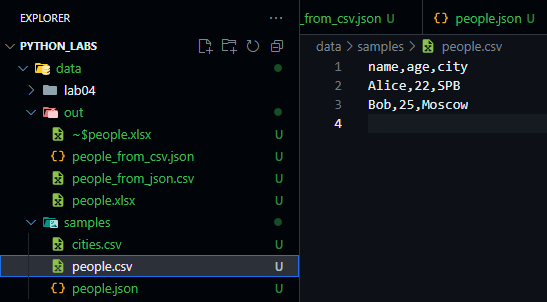

