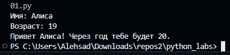
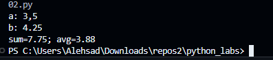
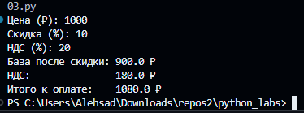
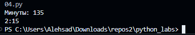
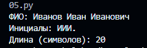
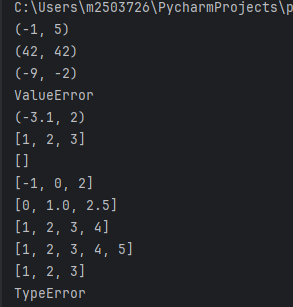
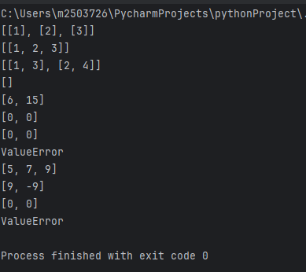
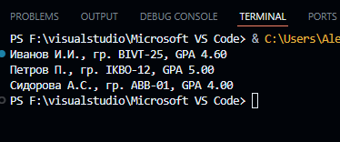
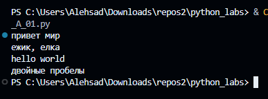
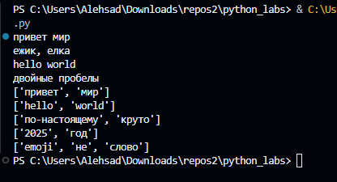

# Alexander

## Лабораторная работа 1

### Задание 1
```python
name = input("Имя: ")
age = int(input("Возраст: "))

print(f"Привет {name}! Через год тебе будет {age + 1}.")
```


### Задание 2
```python
a = input("a: ").replace(",", ".")
b = input("b: ").replace(",", ".")

a, b = float(a), float(b)

s = a + b
avg = s / 2

print("sum=" + str(round(s, 2)) + "; avg=" + str(round(avg, 2)))
```


### Задание 3
```python
price = int(input("Цена (₽): "))
discount = int(input("Скидка (%): "))
vat = int(input("НДС (%): "))

base = price * (1 - discount/100)
vat_amount = base * (vat/100)
total = base + vat_amount

print("База после скидки:", round(base, 2), "₽")
print("НДС:              ", round(vat_amount, 2), "₽")
print("Итого к оплате:   ", round(total, 2), "₽")
```


### Задание 4
```python
m = int(input("Минуты: "))

h = m // 60
mm = m % 60

print(f"{h}:{mm:02d}")
```


### Задание 5
```python
fio = input("ФИО: ")

parts = fio.strip().split()

initials = "".join(p[0].upper() for p in parts) + "."

length = len(fio.strip())

print("Инициалы:", initials)
print("Длина (символов):", length)
```



## Лабораторная работа 2

### Задание 1
```python
def min_max(nums):
    if not nums:
        return "ValueError"
    mn = mx = nums[0]
    for n in nums[1:]:
        if n < mn:
            mn = n
        if n > mx:
            mx = n
    return mn, mx


print(min_max([3, -1, 5, 5, 0]))
print(min_max([42]))
print(min_max([-5, -2, -9]))
print(min_max([]))
print(min_max([1.5, 2, 2.0, -3.1]))


def unique_sorted(nums):
    return sorted(set(nums))

print(unique_sorted([3, 1, 2, 1, 3]))
print(unique_sorted([]))
print(unique_sorted([-1, -1, 0, 2, 2]))
print(unique_sorted([1.0, 1, 2.5, 2.5, 0]))


def flatten(mat: list[list | tuple]) -> list:

  n = []
  for row in mat:
      for i in row:
          if type(i) != int:
            return "TypeError"
          n.append(i)
  return n


print(flatten([[1, 2], [3, 4]]))
print(flatten([[1, 2], (3, 4, 5)]))
print(flatten([[1], [], [2, 3]]))
print(flatten([[1, 2], "ab"]))
```


### Задание 2
```python
def transpose(matrix):
    if not matrix:
        return []

    length = len(matrix[0])
    for row in matrix:
        if len(row) != length:
            return "ValueError"
    return [list(col) for col in zip(*matrix)]


print(transpose([[1, 2, 3]]))
print(transpose([[1], [2], [3]]))
print(transpose([[1, 2], [3, 4]]))
print(transpose([]))


def row_sums(matrix):
    length = len(matrix[0])
    for row in matrix:
        if len(row) != length:
            return "ValueError"

    return [sum(row) for row in matrix]


print(row_sums([[1, 2, 3], [4, 5, 6]]))
print(row_sums([[-1, 1], [10, -10]]))
print(row_sums([[0, 0], [0, 0]]))
print(row_sums([[1, 2], [3]]))


def col_sums(matrix):
    length = len(matrix[0])
    for row in matrix:
        if len(row) != length:
            return "ValueError"

    return [sum(col) for col in zip(*matrix)]


print(col_sums([[1, 2, 3], [4, 5, 6]]))
print(col_sums([[-1, 1], [10, -10]]))
print(col_sums([[0, 0], [0, 0]]))
print(col_sums([[1, 2], [3]]))
```


### Задание 3
```python
def format_record(rec):

    fio, group, gpa = rec

    if not fio.strip() or not group.strip():
        return "ValueError"

    parts = fio.strip().split()
    parts = [p.capitalize() for p in parts]

    if len(parts) < 2:
        return "ValueError"

    surname = parts[0]
    initials = ''
    for p in parts[1:3]:
        initials += p[0].upper() + '.'

    gpa = f"{float(gpa):.2f}"

    return f"{surname} {initials}, гр. {group.strip()}, GPA {gpa}"


print(format_record(("Иванов Иван Иванович", "BIVT-25", 4.6)))
print(format_record(("Петров Пётр", "IKBO-12", 5.0)))
print(format_record(("  сидорова  анна   сергеевна ", "ABB-01", 3.999)))
```




## Лабораторная работа 3

### Задание A01
```python
def normalize(text: str, *, casefold: bool = True, yo2e: bool = True) -> str:
    if yo2e:
        text = text.replace("ё", "е").replace("Ё", "Е")

    if casefold:
        text = text.casefold()

    text = text.replace("\n", " ").replace("\r", " ").replace("\t", " ")

    text = " ".join(text.split())

    return text

print(normalize("ПрИвЕт\nМИр\t"))
print(normalize("ёжик, Ёлка"))
print(normalize("Hello\r\nWorld"))
print(normalize("  двойные   пробелы  "))
```



### Задание A02
```python
def tokenize(text: str) -> list[str]:

    result = []
    word = ""

    for ch in text:
        if ch.isalnum() or ch == "_" or (ch == "-" and word):
            word += ch
        else:
            if word and word[-1] != "-":
                result.append(word)
            word = ""

    if word and word[-1] != "-":
        result.append(word)

    return result

print(tokenize("привет мир"))
print(tokenize("hello,world!!!"))
print(tokenize("по-настоящему круто"))
print(tokenize("2025 год"))
print(tokenize("emoji 😀 не слово"))
```

